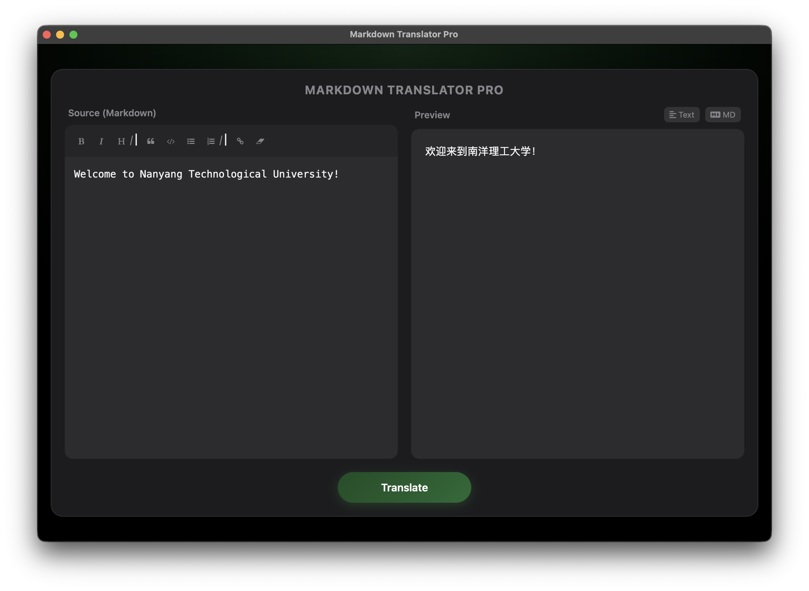

# Markdown Translator


A localized translation tool based on Python + Flask + PyWebView, offering a native Mac app-like experience.



## Features

- **MacOS Style UI**: Dark frosted glass texture, immersive experience.
- **Markdown Editor**: Integrated EasyMDE, supports split-pane real-time preview.
- **Extensible**: Backend based on Flask, easily integrates with OpenAI / DeepL / Baidu Translate APIs.

## Tech Stack

- **Backend**: Python, Flask
- **GUI**: PyWebView (WebKit)
- **Frontend**: HTML5, CSS3, EasyMDE, Marked.js, KaTeX
- **Build Tool**: PyInstaller

## Development

1. Clone the repository:
   ```bash
   git clone https://github.com/yujingyao-dev/MarkdownTranslator
   cd MarkdownTranslator
   ```

2. Install dependencies:
    ```bash
    pip install -r requirements.txt
    ```
3. Add your personal Google genai api key at [.env](.env)

4. Run:
    ```bash
    python app.py
    ```

## How to Build
Mac users can execute the following command to generate the .app file:

 ```bash
 pyinstaller --name "MarkdownTranslator" \
             --windowed \
             --add-data "templates:templates" \
             --add-data "static:static" \
             --clean \
             --noconfirm \
             app.py
 ```

## License
Distributed under the MIT License. See [LICENSE](LICENSE) for more information.

## Acknowledgement
- I thank my father and mother, who give birth to me. 
- I thank Nanyang Technological University, who provides with a chance to try. 
- I thank Google Gemini 3 Pro, who assists my programming.
